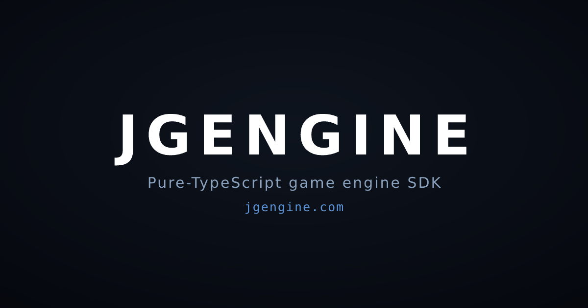

<p align="center">
  
</p>

# jgengine

**TypeScript game engine SDK** for AI agents — npm `jgengine` / `@jgengine/*` · site [jgengine.com](https://jgengine.com) · agent skills ship inside every package tarball (`node_modules/@jgengine/<pkg>/skills/`).

> Not related to automotive “JG Engines” / “JG Engine Dynamics”. This is a software game engine.

A genre-agnostic, pure-TypeScript game engine SDK built for AI coding agents. Agents build games on the SDK using JGengine Skills, which provide intake, focused API guidance, and verification. The core has no React, no renderer, and no backend dependency — adapters connect it to React, Convex, WebSockets, Node hosting, and Postgres, with socket.io, WebRTC peer-to-peer, and LAN as drop-in transports over the same protocol.

## Packages

| Package | What it is |
| --- | --- |
| [`@jgengine/core`](packages/core) | The engine SDK: game runtime, transport/save, state store, entity scene + object store, pool stats/targeting/spatial, combat effects/projectiles/death, loot/trade/quest/social/loadout/unlocks/events/feed/leaderboard, item use, movement/camera/pose, input, interaction, inventory/stats/economy, world features, clocks. Zero dependencies. |
| [`@jgengine/react`](packages/react) | React UI layer: `GameProvider`, hooks, headless primitives. |
| [`@jgengine/ws`](packages/ws) | Browser-safe game backend over a pluggable transport pipe (WebSocket/socket.io/WebRTC/loopback): protocol codec, `createWsBackend`, `createHttpReads`, a browser-safe authoritative host + router, and WebRTC P2P sessions. |
| [`@jgengine/node`](packages/node) | Node bindings over `@jgengine/ws`'s host: WebSocket server, socket.io server attach, memory/file persistence, save-cadence flush. |
| [`@jgengine/sql`](packages/sql) | `HostPersistence` on Postgres through a structural pool interface (no hard `pg` dependency). |
| [`@jgengine/convex`](packages/convex) | Convex adapters: game transport, presence transport. |
| [`@jgengine/shell`](packages/shell) | Game player shell: R3F canvas, orbit camera, input tracking, HUD mounting, `GameUiPreview`, demo game. You supply a `GameRegistry`. |
| [`@jgengine/assets`](packages/assets) | Self-generating, license-verified index of CC0 3D models: ships the typed index + pull CLI, not the GLB bytes. |
| [`jgengine`](packages/jgengine) | Agent-side CLI (`npx jgengine`) — create, skills, doctor, desktop. **People** do not start here; they tell an agent *Make a game that … with jgengine*. |

## Install

```sh
bun add @jgengine/core
# plus the adapters you need:
bun add @jgengine/react @jgengine/shell @jgengine/ws
bun add @jgengine/node @jgengine/sql   # server host
bun add @jgengine/convex               # Convex backend
```

Modules are imported by path, e.g.:

```ts
import { createGameRuntime } from "@jgengine/core/runtime/gameRuntime";
import { createWsBackend } from "@jgengine/ws/createWsBackend";
```

## How people build games (outside this monorepo)

**One interface.** Open any coding agent and say:

```text
Make a game that ... with jgengine
```

Examples: *Make a game that is Mario Party with goo characters, with jgengine* · *Make a game that is a first-person voxel miner, with jgengine*.

That is the whole product surface for humans. No install checklist, no “run skills first,” no required CLI.

Under the hood the agent uses `npx jgengine` (create, skills, doctor) and the skills in [`.claude/skills/`](.claude/skills) — an intake router plus focused API domains, staged into every published tarball at `skills/` so they travel with `node_modules`. Power users may call the CLI themselves; that is optional, not the entry.

The game the agent builds is **its own project in its own repo/directory**, on the published npm packages. Agents must **never clone this monorepo** to build a game, and must **never copy code, assets, or content from `Games/*`** — those are private in-repo test games (some recreate well-known commercial titles for engine-gap probing), not templates, and their content is not licensed for reuse. `npx jgengine create` is the only starting point.

## Website — [jgengine.com](https://jgengine.com)

[`apps/web`](apps/web) is a TanStack Start app: landing for humans (the prompt) and skill/API pages for agents. Skill pages are **rendered from `.claude/skills/jgengine-*`**, with no separate content to maintain.

It deploys to Vercel via Nitro on every push to `main`. Because the site is built from `.claude/skills/` and `packages/`, **shipping an engine or skill change redeploys the site with it** — the deploy of the engine is the deploy of the website. Setup in [`apps/web/README.md`](apps/web/README.md).

Every game under `Games/*` is also playable on jgengine.com itself, at `/games/<id>` via the games page and header dropdown — the page embeds the `apps/dev` runner, which the site bundles as a static build at build time. Root `bun dev` runs this same website locally with the runner served for it in dev, so the games are playable at `/games/<id>` locally too. Outside the browser, `bun run games:<id>` at the root (or `bun dev` inside any `Games/<id>` directory, or an external game scaffolded per `jgengine`'s standalone dev harness) launches one game on its own, no host app required.

## Layering

`core` imports nothing. `ws` and `sql` import only `core`. `react` adds React, `convex` adds Convex + React, `node` adds Node builtins + `ws`, `shell` adds React + three.js (the only package that renders).

## Development

```sh
bun install
bun run build        # tsc + import-extension rewrite, per package
bun run check-types
bun run test
bun dev              # jgengine.com locally, games playable at /play/?game=<id>
bun run games:<id>   # one game standalone, e.g. bun run games:voxel-mine
```

Windows: if `bun` is not recognized after installing, its install directory is missing from PATH — add `%USERPROFILE%\.bun\bin` (PowerShell: `[Environment]::SetEnvironmentVariable("Path", "$env:Path;$env:USERPROFILE\.bun\bin", "User")`) and reopen the terminal.

## Credits

JGengine's procedural buildings, water, rain, and snow renderers were shaped
from **[achrefelouafi](https://github.com/achrefelouafi)**'s MIT-licensed
Three.js reference projects. See [CREDITS.md](CREDITS.md) for the full mapping —
and go star his work.

## License

[AGPL-3.0-only](LICENSE)
